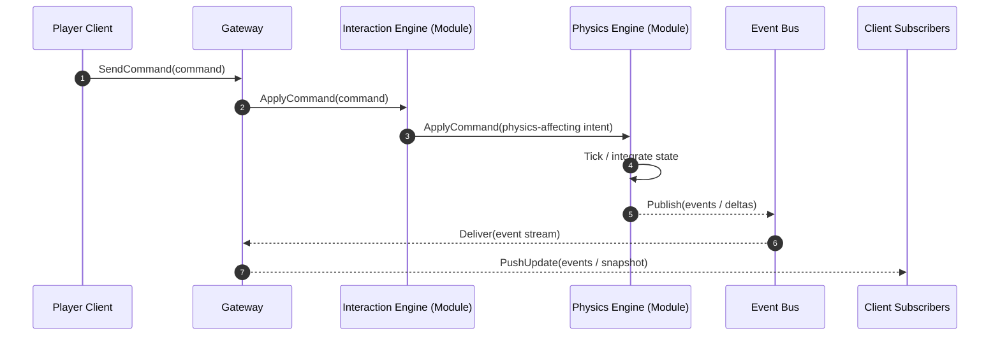
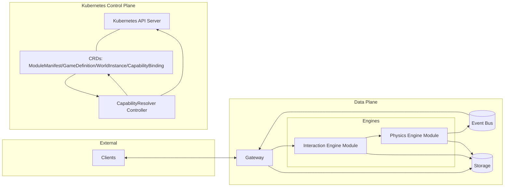

# Platform Architecture

This document describes the high-level architecture of the Anvil platform: a Kubernetes-orchestrated, capability-driven system for composing distributed game engines out of modular components.

## Overall system

### Clients

Clients are the external consumers of the platform (players, admin tools, load generators).

Typical responsibilities:

- Maintain a session/connection to the platform (e.g., WebSocket/HTTP).
- Send player commands (inputs) to the platform.
- Receive state updates and/or event streams.

### Gateway

The Gateway is the platform’s edge entry point.

Typical responsibilities:

- Authentication/authorization and request shaping.
- Session routing (e.g., which world/session a client is interacting with).
- Command ingestion and normalization.
- Fan-out of results (events/snapshots) back to clients.

The Gateway should not embed game logic; it coordinates and routes to engine modules.

### Engines as modules

Engines are deployed as **modules** (separately versioned workloads) that implement well-defined contracts.

Two key ideas:

- **Engines expose capabilities** (what they provide).
- **Engines declare dependencies** (what they require).

At the RPC layer, engine modules can share a baseline gRPC contract (see `proto/game/engine/v1/engine.proto`) for operations such as initialization, command application, ticking, and state snapshotting.

Operationally, engines are expected to be horizontally scalable and independently deployable. Multiple providers may exist for the same capability; selection is resolved declaratively.

### Event bus

The event bus is the internal backbone for asynchronous communication.

Typical responsibilities:

- Publish/subscribe delivery of game events.
- Decoupling producers (engines) from consumers (gateway, other engines, analytics).
- Buffering/backpressure and replay (depending on implementation).

The bus is a transport abstraction; the platform should treat it as an interface, not a hard-coded technology choice.

### Storage

Storage covers durable state and supporting data services.

Typical responsibilities:

- Durable world metadata (world definitions, module configuration, deployment intent).
- Optional snapshots/checkpoints (for recovery, debugging, analytics).
- Audit logs / trace correlation (operational visibility).

A practical design splits storage into “control plane state” (CRDs + cluster state) and “data plane state” (snapshots, event retention, persistent module state).

### Kubernetes as orchestration

Kubernetes is the control-plane substrate.

In this repo, Kubernetes-native resources represent platform intent:

- `ModuleManifest` declares provides/requires for a module.
- `GameDefinition` declares the module set for a game.
- `WorldInstance` declares a running world.
- `CapabilityBinding` declares a resolved dependency from consumer → provider.

A controller (CapabilityResolver) reconciles these resources into stable `CapabilityBinding`s and (in later iterations) can drive the creation/update of runtime workloads.

## Capability model

### provides / requires

A **capability** is a named, versioned interface offered by a module.

- `provides[]` is a module’s outward-facing contract surface.
- `requires[]` is a module’s dependency declaration.

Each requirement includes (at minimum):

- `capabilityId`
- `versionConstraint` (SemVer range)
- `scope`
- `multiplicity` ("1" vs "many")
- `dependencyMode` (required vs optional)

### Capability scopes

Scopes express where a capability instance is valid.

Common scopes used by the platform:

- `cluster` — shared across the entire cluster
- `region` — shared per region
- `world` — scoped to a world instance
- `world-shard` — scoped to a shard of a world
- `session` — scoped per player/session

Scopes constrain what can bind to what: a consumer requirement at a given scope can only bind to a provider at the same scope (v1alpha1 rule).

### Capability binding

A `CapabilityBinding` is the concrete resolution output:

- Consumer: which module has the requirement.
- Provider: which module satisfies it (and at what capability version).
- Scope/multiplicity: the compatibility context.
- Optional `worldRef`: the world instance for which the binding applies.

Bindings are intended to be stable and reproducible: given the same inputs, the resolver should converge to the same set of bindings.

## Resolver workflow

The resolver is a reconciliation loop that computes a desired set of `CapabilityBinding`s for each `WorldInstance`.

Inputs:

- `WorldInstance` selects a `GameDefinition`.
- `GameDefinition` selects a set of participating `ModuleManifest`s.

Resolution steps (high level):

1. Load `WorldInstance` and its referenced `GameDefinition`.
2. Load the participating `ModuleManifest`s.
3. Index all provider capabilities by `(capabilityId, scope)`.
4. For each consumer requirement:
   - Filter candidates by scope and multiplicity compatibility.
   - Filter by SemVer constraint satisfaction.
   - Select providers deterministically (highest satisfying version; tie-break by module name).
5. Reconcile (create/update/delete) `CapabilityBinding` resources to match the computed plan.
6. Surface diagnostics (unresolved required/optional) via status/events.

The workflow is designed for eventual consistency: changes to manifests or world/game definitions converge to the new binding set without requiring imperative orchestration.

## Sequence diagram (command path)

## Component diagram

