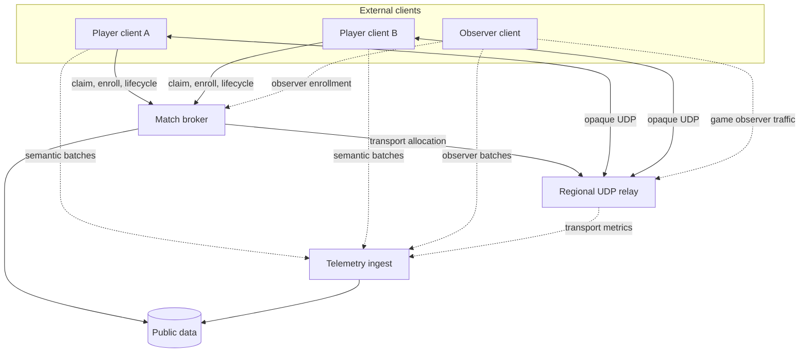

# Architecture

## Responsibility split

The system has four planes. Their separation is the design, not presentation
decoration.

| Plane | Bindery responsibility | External client responsibility |
| --- | --- | --- |
| Control | Identity claims, match intent, enrollment, leases, lifecycle, compatibility checks | Claim identity, request/join match, report readiness and process lifecycle |
| Transport | Relay placement, UDP forwarding, admission, expiry, network metrics | Run game protocol, send/receive packets, maintain relay lease |
| Observation | Ingest, provenance, normalization, derivation, public publication | Extract game observations, buffer, batch and retry |
| Simulation | None | Execute the game and participate in its native multiplayer protocol |

## Logical topology

## Components

### Match broker

One service may own identity claims, sessions and enrollment initially. Splitting
three tiny tables into three microservices would prove only that YAML remains
abundant.

Responsibilities:

- create and verify identity claims;
- create match intent from a compatibility manifest;
- issue join, client and transport leases;
- collect client lifecycle reports;
- ask the placement provider for a relay allocation;
- publish a redacted public representation;
- expire admission and abandoned sessions.

### Relay allocator and relay pool

The allocator selects a relay instance. The relay itself maintains only the
minimum in-memory forwarding state:

- session and participant identifiers;
- authenticated endpoint bindings;
- expiry/heartbeat state;
- packet and rate-limit counters;
- drain/admission state.

An active allocation remains pinned to one relay. Scale-out adds admission
capacity; scale-in drains allocations before termination.

### Client adapter

The adapter is an externally distributed runtime, preferably in a repository
separate from Bindery Core. It:

- authenticates the identity and session lease;
- checks local binary/mod/map compatibility;
- renders the game-specific launch configuration;
- launches and monitors the game process;
- maintains relay registration/heartbeat as required;
- extracts and uploads telemetry asynchronously.

The RA2 adapter may use game hooks, generated `spawn.ini`, post-match
`stats.dmp`, or another compatible extraction path. Those are adapter details,
not core semantics.

### Observer client

`observer` is a control-plane client class with no gameplay authority. The
game-specific realization may still be a normal lockstep peer occupying an
observer slot. The observer can become the preferred semantic capture source,
but player-source observations remain valid and separately attributable.

### Telemetry ingest and publication

The ingest path accepts idempotent batches, validates envelopes and stores the
raw batch before or alongside normalization. It does not block relay traffic or
match lifecycle.

Recommended initial storage split:

- control/index store: identity, match, leases, capture manifests and cursors;
- object store: compressed raw batches, statistics dumps and heavy checkpoints;
- operational metrics: relay and service health;
- optional analytical sink: normalized public events.

The analytical sink is a provider choice. Kafka is not mandatory merely because
the word telemetry appeared in a diagram.

## Trust boundaries

- Account, join and transport tokens are bearer capabilities.
- Clients control their runtime and can submit false telemetry.
- The relay can attest to packets it observed, not semantic game facts.
- Multiple observations may disagree; disagreement is data.
- Public query clients are untrusted and unauthenticated.
- Operator controls protect service availability, not competitive fairness.

## Deliberate coupling

The following coupling is acceptable:

- a match owns its client leases and relay allocation;
- a capture stream references one match and one producing client;
- normalized events reference immutable raw inputs;
- the client adapter knows its game-specific launch and extraction mechanisms.

The following coupling is rejected:

- relay forwarding waiting on telemetry persistence;
- Bindery Core importing RA2 memory addresses or packet structures;
- public data APIs returning internal Kubernetes object representations;
- observer support changing the player enrollment protocol;
- future AI support changing the match broker before an AI client exists.

