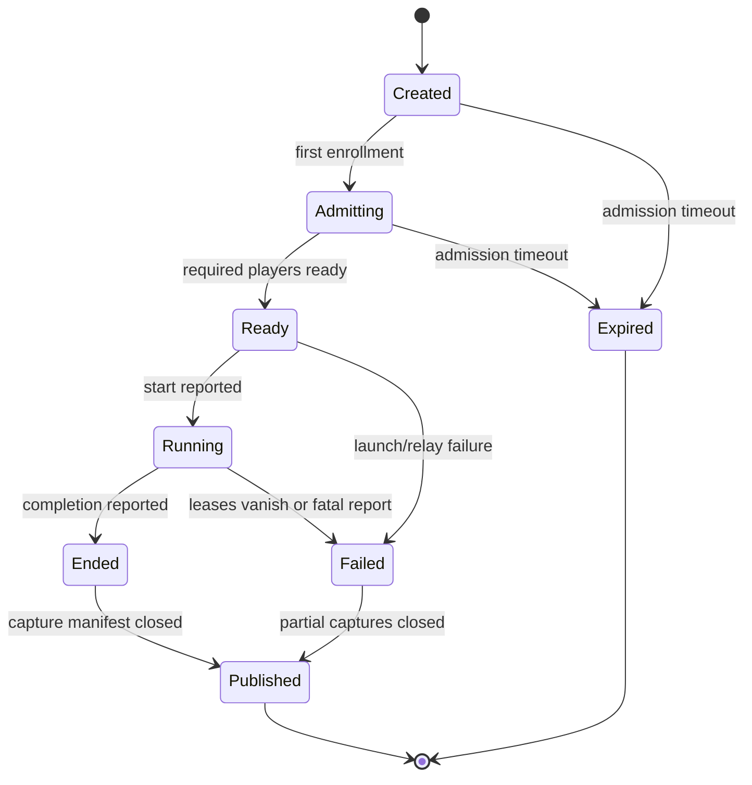
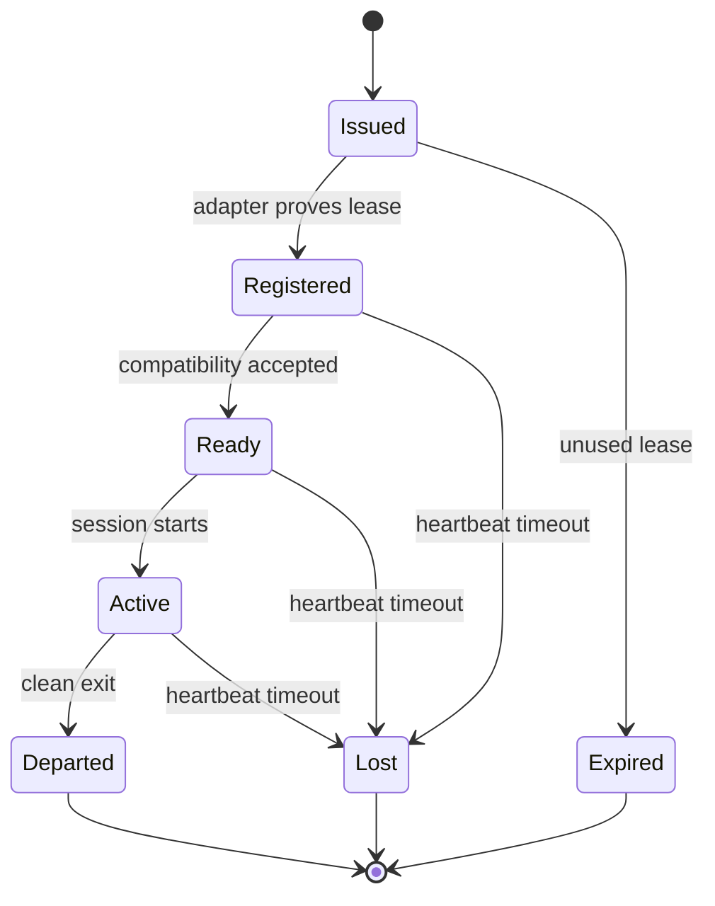

# Domain and lifecycle

## Domain objects

### IdentityClaim

A public identity anchored by an unguessable `account_id` and proved by a bearer
token. It is deliberately weaker than a conventional account.

Public fields include:

- account identifier and handle;
- claim and update timestamps;
- public metadata;
- associations to enrollments, sessions and captures;
- status such as `active` or `suspended`.

The bearer token and stored verifier are not fields of the public object.

### MatchSession

A bounded instance of one compatibility manifest and one participant set.
Tentatively maps to a Bindery `WorldInstance`; see `06-bindery-alignment.md`.

Important fields:

- session identifier and public creation metadata;
- game/adapter/mod/map compatibility hashes;
- participant class limits;
- region/NFR intent and placement decision;
- relay allocation reference, never raw credentials;
- lifecycle phase and transition provenance;
- public telemetry/capture references.

### ClientEnrollment

A runtime instance of an identity participating in one match.

It separates **who** from **which process invocation**. One identity may have
multiple historical enrollments but only the explicitly permitted concurrent
enrollments for a session.

Client classes:

- `player`: participates in the simulation and may submit observations;
- `observer`: participates only through the adapter's supported observation mode;
- future extension: another class can be added by a contract version, including
  an AI-controlled player, without changing identity semantics.

### TransportAllocation

A placement result binding a match to one relay and assigning opaque participant
transport identifiers. Public records contain relay region/provider and policy
metadata. Transport credentials and source endpoints remain private operational
state.

### CaptureStream

One ordered stream of observations produced by a client or relay. A match may
have several streams for the same semantic domain.

Examples:

- relay transport metrics;
- player A live game events;
- observer semantic events;
- player B post-match statistics dump;
- heavy checkpoint snapshots.

### Observation and Derivation

An observation is what a producer reported or a relay measured. A derivation is
a computed interpretation over one or more observations. Neither is silently
promoted to authoritative truth.

## Session lifecycle

Rules:

- `Created` does not imply that relay capacity has been allocated.
- `Ready` means the admission policy is satisfied, not that the game is healthy.
- `Running` is a reported/observed state because Bindery does not own the process.
- `Ended` and `Failed` both permit publication of partial telemetry.
- `Published` closes the initial capture manifest; later derivations may still be appended.
- State transitions record actor, evidence source, time and transition reason.

## Enrollment lifecycle

No state transition implies gameplay guilt, innocence or winner status.

## Observer lifecycle

The observer uses the same enrollment state machine. Differences are declared
through class-specific permissions and adapter capabilities:

- it cannot report player actions as its own actions;
- it may submit observations covering all visible participants;
- it may require a game observer slot and therefore affect admission capacity;
- its failure degrades capture completeness but does not fail a running match;
- absence of an observer is an explicit capture mode, not an error for the
  two-player baseline.

## Idempotency keys

- identity creation: client-provided request id, short retention;
- session creation: `(account_id, request_id)`;
- enrollment: `(session_id, account_id, client_instance_id)`;
- telemetry batch: `(capture_id, producer_client_id, first_sequence, last_sequence)`;
- lifecycle report: `(client_id, report_id)`.

Retries must return the original result or a stable conflict, not create shadow
sessions and duplicate public histories.

