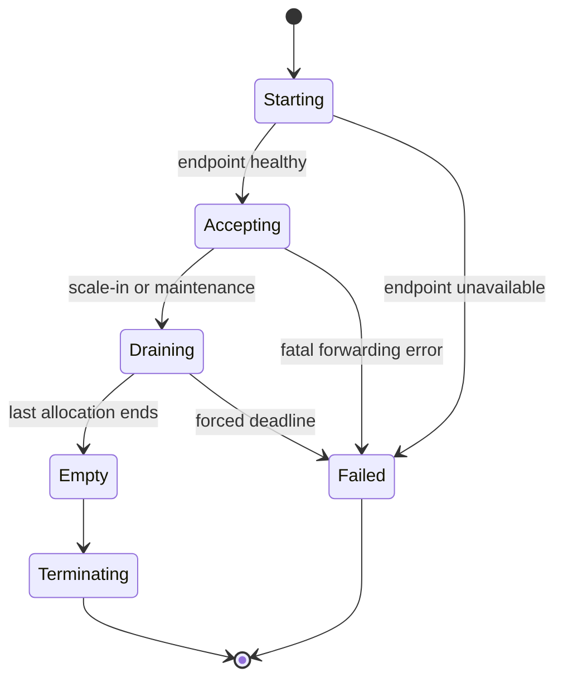

# Deployment, scaling and recovery

## Reference deployment

Initial Kubernetes services:

- `match-broker`: HTTP/gRPC control plane and public read API;
- `relay-allocator`: placement/admission logic, initially deployable with the broker;
- `udp-relay`: regionally placed relay pool with stable public UDP endpoints;
- `telemetry-ingest`: batch/object ingest and normalization dispatch;
- `public-data`: query/index service, initially deployable with ingest;
- control database and object storage providers.

The first slice should prefer fewer binaries with clear package boundaries. The
capability model can still express separable providers without paying the full
distributed-systems tax immediately.

## Relay exposure

An active relay needs a stable externally reachable UDP endpoint and predictable
packet routing. The allocator must select an addressable relay instance, not a
generic Service that can send consecutive datagrams for one allocation to
different pods.

Credible implementation options:

1. **One LoadBalancer/public endpoint per relay instance** — clearest semantics,
   potentially expensive.
2. **Node-bound UDP relay using host networking or a fixed node port** — useful
   for a homelab/research cluster, with explicit node placement.
3. **Provider-specific UDP load balancing with verified affinity** — acceptable
   only after packet-flow tests prove the mapping behavior.

Recommendation: begin with one explicitly advertised endpoint per relay
instance. Optimize endpoint density after the session/drain semantics work.

## Placement

Placement input:

- per-client region probes or observed RTT;
- allowed regions and hard jurisdiction/topology constraints;
- relay accepting/draining state;
- active endpoint and session counts;
- packets per second and egress headroom;
- provider cost/priority policy version.

Suggested objective for two players:

1. filter providers that violate hard constraints;
2. minimize the maximum predicted player-to-relay RTT;
3. use mean/p95 RTT as the second ranking dimension;
4. prefer greater remaining packet/egress capacity;
5. break ties deterministically by provider and relay identifier.

Record all candidate inputs, exclusions and the policy version in the public
placement decision, excluding source network addresses.

## Autoscaling is admission scaling

The relay fleet is stateful even when each relay stores only endpoint mappings.
Scaling behavior:

- add relay instances when accepting capacity falls below a headroom threshold;
- allocate new matches only to accepting instances;
- mark an instance `Draining` before scale-in or maintenance;
- retain its public endpoint until all allocations end or a hard deadline is reached;
- terminate only after it becomes `Empty`;
- classify deadline-forced termination as match transport failure, not migration.

Useful scaling signals:

- active session and endpoint leases;
- packets/second and bytes/second;
- egress saturation;
- event-loop lag or forwarding queue pressure;
- CPU/memory as secondary safety signals.

The existing CPU/memory `ShardAutoscaler` should not be reused. A world shard is
game topology; a relay replica is admission capacity.

## Relay state machine

## Failure behavior

| Failure | Expected behavior |
| --- | --- |
| Broker unavailable after launch | Existing relay path continues; lifecycle reports buffer/retry |
| Telemetry ingest unavailable | Client buffers within bounds; gameplay continues |
| Public query unavailable | Ingest/control continue; publication catches up |
| Relay lost before game start | Allocation fails; broker may select another relay and reissue transport leases |
| Relay lost during game | Match becomes `Failed`; retain partial captures; no migration promise |
| One player disappears | Native game behavior applies; lease expires and public lifecycle records loss |
| Observer disappears | Capture becomes degraded; match continues |
| Client buffer fills | Apply declared drop/stop policy and publish gaps/drop counters |
| Normalizer fails | Raw batch remains durable and replayable |
| Account token lost | Historical identity remains; user creates a new identity |

## Recovery and rollback

### Service recovery

- Rebuild broker state from the control database and active relay lease reports.
- Reconcile capture manifests from immutable raw objects and ingest indexes.
- Treat relay in-memory endpoint mappings as non-recoverable mid-match state.
- Preserve idempotency records beyond the maximum client retry window.

### Rollback boundaries

- Broker/API rollback must retain backward-compatible readers for already issued
  client and capture lease versions.
- Telemetry normalizer rollback selects the previous version and replays raw
  batches; it never rewrites raw objects.
- Observer rollout is feature-gated per Booklet/session. Disable observer
  admission to return to the two-player topology.
- A native relay can be replaced by a baseline tunnel provider for new sessions;
  existing allocations drain on their original provider.

### GitOps checks

Before rollout:

- schema and compatibility tests pass;
- public-response redaction fixtures pass;
- relay endpoint and UDP affinity tests pass from two external networks;
- PodDisruptionBudget/drain settings prevent voluntary eviction of active relays;
- dashboards expose accepting versus draining capacity;
- rollback images and previous contract versions remain addressable.

After rollout:

- create a synthetic session through the public endpoint;
- enroll two probes and verify both resolve the same relay allocation;
- send bidirectional UDP and confirm per-session counters;
- interrupt telemetry ingest and verify packet forwarding remains stable;
- drain one relay and verify only new sessions move elsewhere.

